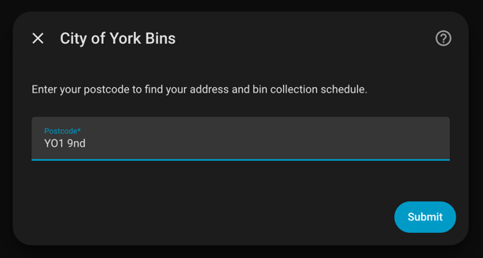
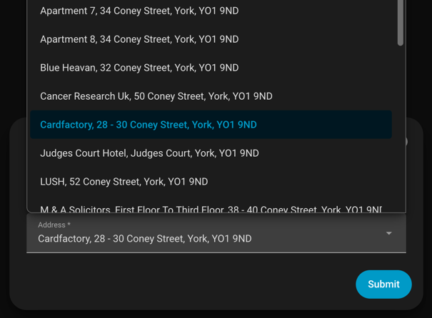
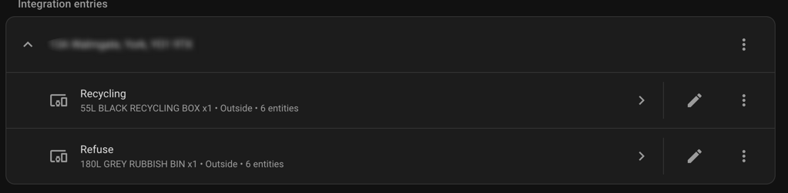
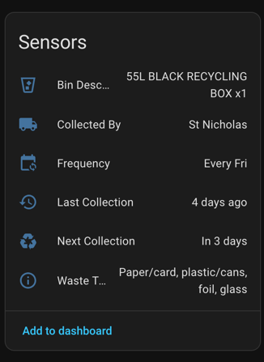

# 🗑️ City of York Bins — Home Assistant Integration

A Home Assistant custom integration that pulls bin collection schedules from the City of York Council waste API and exposes them as sensors in your home.

---

## 🤖 AI Disclosure

This integration started life as a minimal proof-of-concept written by hand. It has since been substantially rebuilt with the assistance of AI (Claude by Anthropic) — refactoring it into a modern, config-flow-based integration with proper sensor entities, a DataUpdateCoordinator, and device support. The original concept and domain knowledge are human; the heavy lifting of the rewrite was AI-assisted.

---

## 📋 Description

If you live in the City of York, this integration will show you exactly when your bins are next being collected — directly in your Home Assistant dashboard, without having to check the council website.

It connects to the [City of York Council waste collection service](https://www.york.gov.uk/WasteCollectionCalendar) and creates a device per bin type (Refuse, Recycling, Garden) each with sensors for next collection date, last collection date, frequency, waste type, bin description, and collector.

Collection dates are displayed as relative timestamps by Home Assistant ("tomorrow", "in 3 days") and refresh automatically once a day.

---

## 📦 Installation

### Via HACS (recommended)

This integration is not yet in the default HACS store. Add it as a custom repository:

1. Open HACS in your Home Assistant sidebar
2. Click the three-dot menu (⋮) in the top right and select **Custom repositories**
3. Paste `https://github.com/joeShuff/ha-york-binday` as the repository URL
4. Set the category to **Integration**
5. Click **Add**
6. Search for **City of York Bins** in HACS and click **Download**
7. Restart Home Assistant

### Manual

1. Download or clone this repository
2. Copy the `custom_components/york_bins` folder into your Home Assistant `config/custom_components/` directory
3. Restart Home Assistant

---

## ⚙️ Setup

1. Go to **Settings → Devices & Services → Add Integration**
2. Search for **City of York Bins**
3. Enter your postcode — the integration will look up all addresses at that postcode
4. Select your address from the dropdown

> **Screenshot — Postcode step**
> 

> **Screenshot — Address picker**
> 

> **Screenshot — Devices in HA**
> 
> 

Once set up you'll have one device per bin type, each with these sensors:

| Sensor | Example value |
|---|---|
| Next Collection | in 3 days |
| Last Collection | 9 days ago |
| Frequency | Every alternate Tue |
| Waste Type | Paper/card, plastic/cans, foil, glass |
| Bin Description | 55L BLACK RECYCLING BOX x3 |
| Collected By | City of York Council |

---

## 🤖 Example Automations

See [`automations/`](automations/) for ready-to-use examples, including:

- Morning notification on bin day
- The night before reminder
- Dashboard badge that turns red when collection is tomorrow

---

## 🤝 Contributing

Contributions are welcome! If you find a bug, have a feature request, or want to improve the integration:

- **Bug reports & feature requests** — open an [issue](https://github.com/joeShuff/ha-york-binday/issues)
- **Pull requests** — fork the repo, make your changes, and open a PR against `main`
- **Testing** — if you're a York resident and something doesn't look right for your address, please open an issue with your bin types (no need to share your UPRN)

If you find this useful, feel free to ⭐ the repo — it helps others find it.